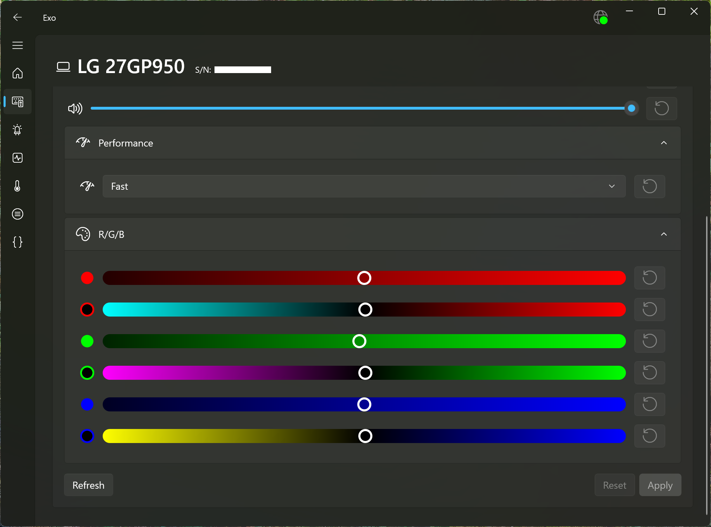

Exo is a lightweight background service bundled with a nice modern Windows UI, that will manage the features of your devices without sacrificing your memory or CPU.

With Exo, you can get rid of many low-performing apps on your computer, and free some useful resources.

You can check the [Supported Devices](devices.md) page to see if your device is supported.

Download a [recent build](https://github.com/hexawyz/Exo/actions), or [a release](https://github.com/hexawyz/Exo/releases) on GitHub.

# Prerequisites

* .NET 8.0.8 runtime: https://dotnet.microsoft.com/en-us/download/dotnet/8.0
* Windows App SDK 1.6 Runtime: https://aka.ms/windowsappsdk/1.6/1.6.240829007/windowsappruntimeinstall-x64.exe

# Features

## Quick Battery Summary on the Home Page

Something that you may miss is the ability to quickly check the battery state of your devices.
Exo provides that on its home page, so that this is the first thing you see when opening the app.

## Notifications

Overlay notifications will be shown for changes in your devices, for devices supporting it.

Shown above are examples of the notifications that Exo can show.

## List of recognized devices

On this page, you will quickly know which devices are currently recognized by Exo, and which ones are currently connected.

It will allow you to access device-specific informations and settings.

## Wireless USB dongles support

When you connect one or more device through a custom USB dongle, such as Logitech and Razer ones, Windows won't be able to tell what devices are behing the Dongle.

The ability to see which real devices are connected through a dongle is a very important one for proper support of your devices, and Windows cannot do this out of the box.

## Identify devices by serial number

While not all devices are able to expose their serial number to software, most of them actually do.

Exo will strictly identify devices by their serial numbers, even in cases where Windows wouldn't be able to, and display that information to you in the UI.

## Mouse settings

Capability to configure DPI presets and change the active preset are implemented in Exo, as well as ability to support 

## Battery and Power settings

For the devices where it is applicable, Exo will display detailed battery informations and allow to configure some power saving settings.

## Monitor settings

Exo has built-in support for various monitor settings, based on what the monitor reports.

⚠️ Some monitors will lie about the feature they support, so you should be careful when playing with monitor settings.

A specific configuration may need to be written for your particular monitor(s) to inform Exo about how to work with it.
This can also be done to enable non-standard Monitor features supported by Exo.

As you can see in the screenshots above, some monitors support less features than others.

## RGB Lighting

Exo will manage the RGB lighting of devices, as long as they are supported, of course.

Only hardware effects are supported at the moment (no custom/dynamic lighting effects), which is the best choice to reduce CPU usage anyway.

The option to persist lighting settings to non-volatile memory of the device is also provided, if the device supports it.

Support for unified lighting effects can also be toggled for mlti-zone devices that support it.

## Sensors

Exo has support for listening to hardware device sensors.

This is mainly used for low-level devices such as a GPU or a PSU, but being able to take a quick look of the status of your devices should be useful.

More importantly, having a wide source of sensors is necessary to support software cooling curves.

## Cooling (WIP)

⚠️ This feature is not yet entirely complete. Notably, the settings won't be persisted and applied on service startup.

Exo is able to change cooling settings of devices. (Fan power, Pump power)

It also supports applying software cooling curves based on available sensors.

# How

Exo is implemented as a Windows service, which will start very early and consume a few dozens of MB at most.

This is far from the hundeds of MB that a single manufacturer app would typically consume, and which would usually only run once your session is started.

The UI is kept as a separate component in order to preserve precious system resources, and allow you to only show it when you need it.

As you can see on the screenshot above, Exo memory consumption is pretty reasonnable, topping at about 46 MB of exclusive memory for the background service, while handling more devices and combined features than a software you would use for a single device.
